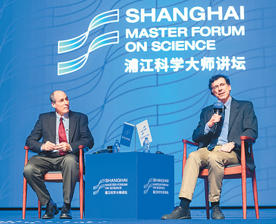

# 2024世界顶尖科学家协会奖“智能科学或数学奖”获得者 ——克莱因伯格：科技向善 促进算法公平 （科教人物坊）
[原文刊载于《人民日报海外版》（2024年11月04日 第 09 版）](http://paper.people.com.cn/rmrbhwb/html/2024-11/04/content_26088829.htm)

 
克莱因伯格（右）在复旦·浦江科学大师讲坛活动中回答现场观众提出的问题。
（资料图）

 
克莱因伯格（右二）被授予2024世界顶尖科学家协会奖“智能科学或数学奖”。图为领奖现场。
（资料图）

“算法只认识数据，除此之外一无所知，它只是尽可能忠实地再现它在数据中看到的东西，算法本身不会产生偏见。”近日，在上海举行的“复旦·浦江科学大师讲坛”上，美国康奈尔大学计算机科学和信息科学讲席教授乔恩·克莱因伯格（Jon Kleinberg）这样表达对所谓“算法偏见”的看法。在他看来，所有偏见都源于人类自身并成为数据的一部分，而先进的算法可以更容易检测到数据中的偏见并采取相应措施，更好地基于数据对人工智能模型进行训练。

作为国际智能科学领域领军人物之一，克莱因伯格研究视野宽广，囊括计算机网络路由、数据挖掘、生物结构比对等，并在计算机科学与社会科学交叉领域作出了诸多开创性贡献，特别是在社会网络和算法公平性研究方面。他因此被授予2024世界顶尖科学家协会奖“智能科学或数学奖”。

## 传递火炬发扬光大

笔挺的灰西装、深蓝色领带、淡蓝的衬衣，克莱因伯格一改往日在校园里的休闲打扮，一身正装出席论坛并发表演讲。在演讲中，他对中国同行近年来所取得的研究成果，给予高度评价并强调加强国际科学交流与合作的重要性。

克莱因伯格说，中国是全球信息科技特别是人工智能主要创新中心之一，为风起云涌的信息技术革命作出了突出贡献，正是有了包括众多中国同行在内的各国科学家共同的努力和智慧，国际信息科技特别是计算技术这些年才呈现高速发展的态势。克莱因伯格由此强调加强国际科技界交流与合作的重要性。在他看来，这种合作不仅包括同一学科、同一领域内，不同国家和地区专家学者之间组成紧密的科技共同体，通过线上线下等多种方式沟通与协作，而且包括跨学科、跨领域的国际大交流、大协作。克莱因伯格指出：“我倾向于把科学界看作是一个在国家之间、社会之间、不同研究领域之间有大量合作的群体。保持这种跨学科的合作，这种在不同国家和社会之间的合作，对科学界来说非常重要。”

克莱因伯格结合自身成长的经历，说明交流的重要性。1993年的一天，当时就读于康奈尔大学的克莱因伯格现场聆听了美国知名科学家卡尔·萨根的一场科普演讲，从中获得极大启发。萨根演讲中的一些表述，好像一根魔法棒在他心中点亮了一盏明灯，进一步激发了他对科技的好奇与探索的愿望。不仅如此，萨根的那场演讲提出的“从现象中识别模式”的思路甚至为克莱因伯格后来的创新指明了一条路径。他说，这条思路深深影响了他日后利用算法研究人类社会的方式。

科技创新事业是不熄的火炬，在一代代人手中传递，克莱因伯格从萨根手中接过熊熊燃烧的科技火炬并力图进一步发扬光大。在复旦的演讲中，他既阐释自己对当今计算领域前沿问题的见解和主张，也旁征博引同行的观点和看法。值得一提的是，克莱因伯格还向现场听众抛出了萨根当年演讲时提出的一个问题并结合他的算法理论给出了自己的答案，引导大家去思考和探索。

## 学以致用服务社会

1997年，26岁的克莱因伯格发表了一篇题为《外部网络的HITS算法》论文，率先提出“链接分析算法”，超越了之前将互联网视作链接列表的思维，通过给不同网站赋分，来评估网站的能力。该算法很快应用于全球多个著名搜索引擎中，成为链接分析中最为重要的基础算法之一并为谷歌公司的网页排名算法的诞生提供了灵感，对搜索引擎技术的发展产生了极其深远影响。凭借这一卓越成就，克莱因伯格声名鹊起，迅速成为国际算法领域的重要人物之一。此后，他在算法设计与分析、跨学科研究以及社会网络分析方面接连取得显著成果，尤其是与匈牙利数学家伊娃·塔多斯合著了《算法设计》一书，被认为是算法领域的世界经典教材。

就在算法演进成为国际计算领域的显学而备受追捧之际，克莱因伯格把关注的目光投向算法公平，致力于改变弱势群体在互联网时代所处的不利地位，旨在以算法公平促进社会公平。在克莱因伯格看来，促进算法公平必须关注不同人群的网络可及性差异，特别是有些人群受制于种种条件，没有移动终端或者无法接入网络，不能形成相应的网络数据，然而算法必须关注而不是忽视这样的人群的利益。此外，克莱因伯格还主张算法必须关注文化多样性，避免趋同性与单一性。对此，他解释说，如果人们使用同一种算法做决策，那么就会导致选择高度趋同，进而导致文化日益单一化，他希望人们在使用算法工具时，高度重视数据多元化和文化多样化。

作为国际知名的科学家，克莱因伯格始终坚持学以致用，服务社会，而不是固守在大学的象牙塔内。他指出，计算科学的发展推动互联网应用领域空前扩大，特别是社交媒体兴起，使网络已不再只是储备人类知识的“超级图书馆”，而是全面渗透到人类社会生活各领域、涵盖人类各种行为的庞大生态系统。因此，研究网络科技发展的专家必须密切关注社会。他不仅身体力行，广泛深入到社会生活中，研究人们的网络使用行为，而且鼓励自己的学生毕业后走出学术“象牙塔”，走进社会生活，特别是到互联网产业界发展，因为“真实、鲜活的网络数据并不是产生于学界，而是产生于活力十足的产业界”，在那里可以为社会作出更大贡献。

在克莱因伯格的影响和带动下，他的很多学生如巴克斯托姆、吴少玫等，在博士毕业后加入国际社交媒体脸书公司等，前者成为脸书公司新闻推送部主管，后者在脸书公司历练一段时间后，创立了一家旨在赋能弱势群体的科技非营利组织并任该组织首席执行官。

## 家学传承跨界合作

克莱因伯格的成就得益于诸多因素，深厚的家学渊源是其中之一。1971年，克莱因伯格出生于美国波士顿的一个数学世家：祖父辈从事数学研究，父亲是美国麻省理工学院数学教授。从小浸淫于这样的家庭文化氛围中，克莱因伯格很早就开始了数学启蒙。他从小就兴趣非常广泛，除了数学之外，还喜欢读小说等。上中学时，他有时编写一些游戏程序并提供给朋友玩。他后来回忆说，当时只是觉得编程很好玩、很酷，并不知道这与自己将来的研究密切相关。

1993年，克莱因伯格从康奈尔大学本科毕业，获得数学和计算机双学位。他之后进入麻省理工学院深造，仅用3年就取得该院博士学位。适逢网络技术空前大发展的时代，克莱因伯格凭借深厚的数学功底和对网络发展趋势、社会结构的深刻把握，很快提出“链接分析算法”，之后接连在网络技术领域取得一系列卓越成就，成为业内人士津津乐道的佳话。

随着算法研究的深入和拓展，克莱因伯格从小就广泛发展的兴趣逐渐与算法研究交汇起来，赋予他独特而丰富的科研维度和学术视角，不断开拓新的研究境界。比如，他中学阶段一度对法律产生浓厚兴趣，研读了很多法律书籍，甚至一度萌生了从事律师职业的念头。多年之后，他把自己的算法研究引入法律领域，探讨算法与刑事司法预测的关系。这种跨界研究对很多人来说是难以想象的，但是对于克莱因伯格来说，这是再正常不过的事。因为在他的思维框架中，算法与社会生活各领域天然交织在一起，开展各种跨学科的合作不仅是可能的、应该的，而且是必须的。这造就了他的研究风格：自成一派、丰富多元。

学术有专攻，跨界研究必须寻求合作伙伴。多年来，克莱因伯格一直在多个领域寻找科研合作伙伴并携手开展了诸多卓有成效的研究工作。据了解，与他搭档过的科研合作伙伴多达50多位。哈佛大学著名经济学家森迪尔·穆莱纳坦就是其中之一。两人是康奈尔大学就读时的同窗好友，合作始于本科时合写一项课程作业，至今已经保持了30多年，共同发表近30篇学术论文。

## 良师益友提携后学

克莱因伯格教授的“算法设计”课是康奈尔大学学子的最爱之一，这在很大程度上得益于他化繁为简、深入浅出的讲解风格。上海财经大学理论计算机研究中心副教授伏虎曾是克莱因伯格班上的学生，他对其讲课风格记忆犹新：“他的课听起来非常平实，每一句都容易理解，大家顺着一句句听下去，忽然发现他把一个极其深奥的算法设计问题讲得非常清晰明了。”

萨根是克莱因伯格非常欣赏的科学家，也是举世闻名的科普专家。作为教育工作者和知识的传播者，克莱因伯格在27年的教学生涯中一直向萨根学习，尝试用简洁、朴实的语言讲解深奥科学道理，并赢得了众多学生的认可和喜爱。

克莱因伯格授课的另一大特色是，不用提前准备好的“演示文稿”（PPT），而是现场在黑板上写板书。克莱因伯格课堂上的场景通常是这样，他在黑板前写，学生在下面聚精会神地看并思考，随后双方互动交流，时不时对板书的内容进行调整补充。这虽然颇为费时费力，也显得旧派，但是他一直坚持下来。“写板书是克莱因伯格与同为康奈尔计算机教授的妻子莉莲·李的共同习惯。记得他常常一口气写下几块板书，使用的粉笔是特制款，写起来流畅无声。比起用PPT，我们感觉他的板书教学更具引导性、互动性和灵活性。”吴少玫这样回忆道。

克莱因伯格以身作则，治学严谨；同时谦虚谨慎，鼓励学生大胆表达观点并通过平等交流，引导学生得出结论。“我有一个别的想法，供你参考。”这是他常对学生说的一句话。在修改学生的论文时，他会详细注明每一处修改的原因，并且通常加上一句：“若你认为我改得不对，还可以改回去。”

作为老师和学界前辈，克莱因伯格奖掖后学不遗余力。对此，吴少玫感受颇深。她说，经常有学生找克莱因伯格写推荐信，他都积极回应，根据对学生的了解特别是学术研究能力的认识，做出客观公正的评价。克莱因伯格就曾给她写过推荐信。“他从来二话不说，热情帮助，对年轻人不遗余力地托举。真的很感激他！”吴少玫说。

（侯天泽 王其馨 卢天姿 丁超逸 伍静）

